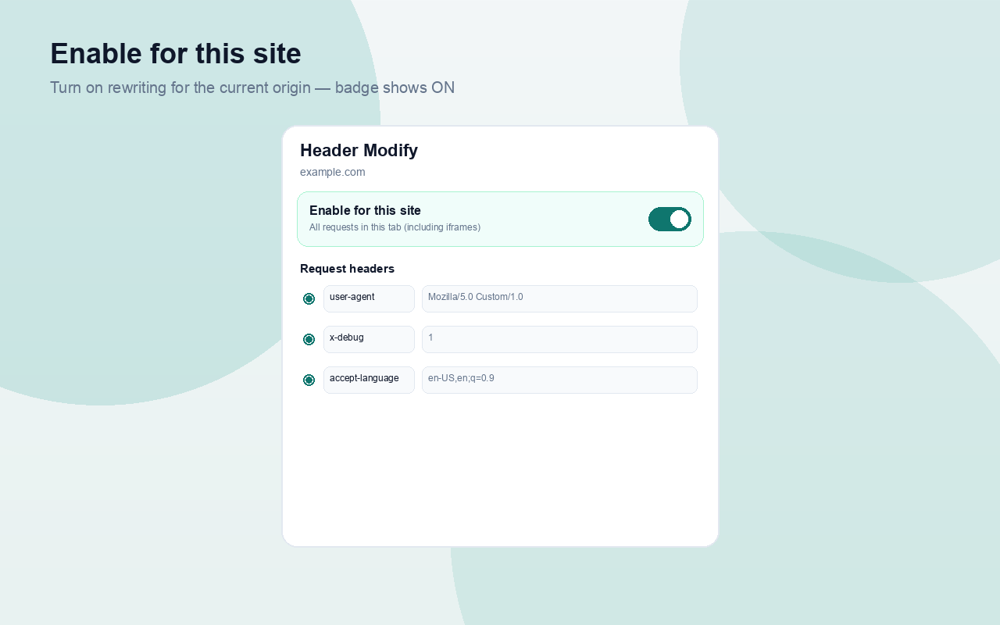
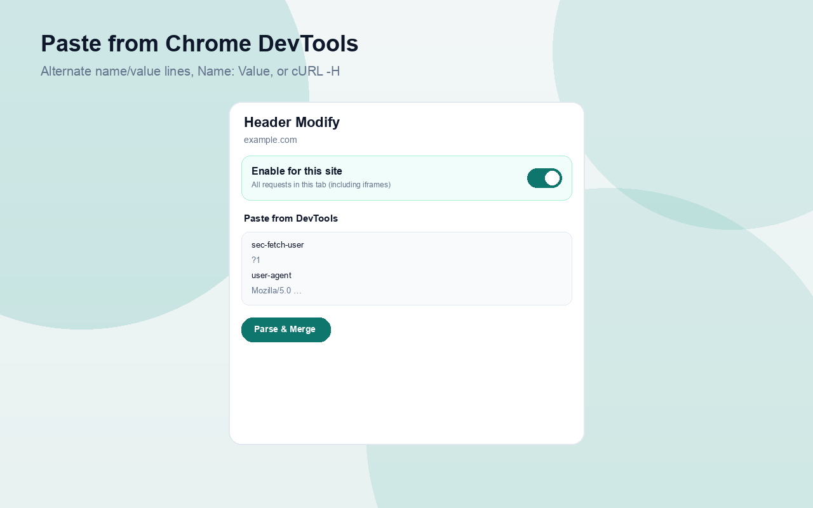
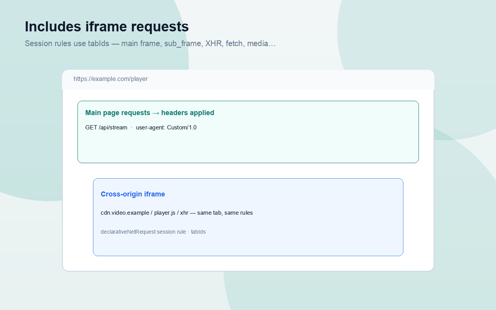

# Header Modify

**Languages**

- **English** (current)：[README.md](README.md)
- **中文**：[README.zh_CN.md](README.zh_CN.md)

<p align="center">
  
</p>

Chrome extension that **rewrites request headers** for the current site. When enabled, every request from that tab — including **iframe / XHR / fetch / media** — gets your headers applied with **set** semantics (add if missing, replace if present).

> **Built with:** [chrome-extension-boilerplate-react-vite](https://github.com/webLiang/chrome-extension-boilerplate-react-vite) — a React + **Vite 8** Manifest V3 boilerplate with **faster builds**. This extension is developed on top of that template. **Stars** and **Merge Requests** are welcome.

---

## Chrome Web Store

Publishing guide and paste-ready listing copy (5 languages), privacy policy, review justification, and promo images:

- [STORE.md](STORE.md) · [STORE.zh-CN.md](STORE.zh_CN.md)
- [docs/chrome-web-store/](docs/chrome-web-store/) — listings, images, checklist
- [PRIVACY.md](PRIVACY.md) · [PRIVACY.zh-CN.md](PRIVACY.zh-CN.md)

```bash
pnpm build
pnpm zip   # → releases/header-modify-extention_v{version}.zip
```

Regenerate icons / store images:

```bash
pnpm assets:store
pnpm build
```

---

## Preview

**Enable for this site** — turn rewriting on for the current origin. Rows below are applied with *set* semantics (add if missing, replace if present).

<p align="center">
  
</p>

**Paste from DevTools** — copy headers from Chrome Network (name/value lines, `Name: Value`, or cURL `-H`), paste, then **Parse & Merge**.

<p align="center">
  
</p>

**Includes iframes** — session rules are scoped by `tabIds`, so the main page, cross-origin iframes, XHR, fetch, and media in that tab all get the same headers.

<p align="center">
  
</p>

---

## Features

- Enable rewriting **per site** (remembered by origin).
- Applies to the **current tab’s requests**, including cross-origin **iframes** (via `declarativeNetRequest` session rules + `tabIds`).
- Paste headers copied from Chrome DevTools (alternate name/value lines), `Name: Value` blocks, or cURL `-H` flags.
- Edit / toggle / delete individual headers in the popup.
- Export / import JSON profiles.
- UI languages: English, 中文, Español, हिन्दी, العربية.

---

## How it works

Manifest V3 cannot use blocking `webRequest`. This extension uses:

`chrome.declarativeNetRequest.updateSessionRules`

with `action.type = "modifyHeaders"` and `operation: "set"`.

Rules use `condition.tabIds` for in-tab requests, plus `initiatorDomains` so Service Worker / Turbo document fetches (no tabId) still match. Header lists and enabled origins persist in `chrome.storage.local`; session rules are rebuilt when tabs or settings change.

**User-Agent:** Chrome also sends **User-Agent Client Hints** (`Sec-CH-UA`, `Sec-CH-UA-Platform`, …). Many sites ignore the `User-Agent` string and use those hints instead. When you set `User-Agent`, this extension **removes** those hint headers so the override can take effect.

**DevTools:** Network may still show the original UA under “Provisional headers are shown”. Check the server (e.g. https://httpbin.org/headers) or a request that is not marked provisional. `navigator.userAgent` in page JavaScript is **not** changed by DNR.

**Protected headers:** Chrome will not SET hop-by-hop / fetch-metadata names such as `Host`, `Content-Length`, or `Sec-Fetch-*`. Those rows are skipped so they do not fail the whole rule (including User-Agent).

---

## Install (development)

```bash
pnpm install
pnpm build
```

1. Open `chrome://extensions/`
2. Enable **Developer mode**
3. Click **Load unpacked** and select the `dist/` folder

Dev mode with reload:

```bash
pnpm dev
```

---

## Usage

<p align="center">
  
</p>

1. Open a normal `http(s)` page.
2. Click the extension icon.
3. Paste DevTools request headers (or add them manually).
4. Turn on **Enable for this site**.
5. Reload the page and inspect Network — requests should show your headers.

### DevTools paste example

```text
sec-fetch-user
?1
upgrade-insecure-requests
1
user-agent
Mozilla/5.0 (Macintosh; Intel Mac OS X 10_15_7) AppleWebKit/537.36 (KHTML, like Gecko) Chrome/150.0.0.0 Safari/537.36
```

---

## Permissions

| Permission | Why |
|---|---|
| `storage` | Persist headers, enabled origins, language |
| `tabs` | Resolve the active tab / origin and keep rules in sync |
| `declarativeNetRequest` | Apply header modifications |
| `declarativeNetRequestFeedback` | Optional feedback APIs for rule diagnostics |
| `<all_urls>` host permission | Required to modify headers on page / iframe requests |

---

## Scripts

| Command | Description |
|---|---|
| `pnpm dev` | Watch build + HMR helpers |
| `pnpm build` | Typecheck + production build → `dist/` |
| `pnpm test` | Vitest (watch) |
| `pnpm test:run` | Vitest once |
| `pnpm lint` | ESLint |
| `pnpm zip` | Pack `dist/` → `releases/header-modify-extention_v*.zip` |
| `pnpm build:zip` | Production build + zip |
| `pnpm release:github:dry` | Build zip + preview GitHub Release notes (no tag/push) |
| `pnpm release:github:full` | Build, commit, tag, `gh release create`, push |
| `pnpm assets:store` | Regenerate icons + store promo/screenshots |

---

## Changelog

| Version | Notes |
|---|---|
| v1.0.0 | Initial open-source release: popup editor, DevTools paste, per-site enable, DNR tab-scoped rewrite |

---

## License

MIT
